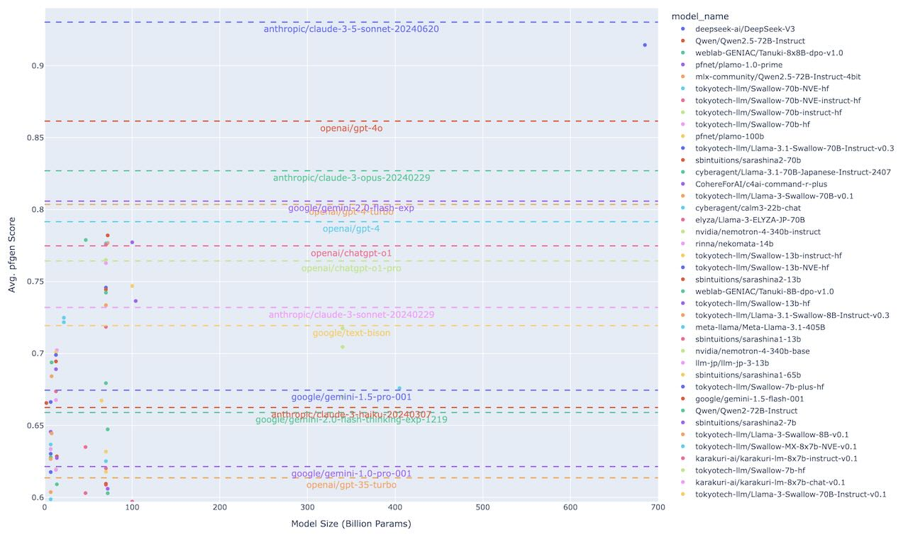

# pfgen-plots

This repository contains the code to generate the plots for the evaluation results of [pfgen-bench](https://github.com/pfnet-research/pfgen-bench).

See the plotly plot [here](https://mitmul.github.io/pfgen-plots/html/pfgen_bench_20250102.html). You can adjust the scale and pick what to show in the plot.



## Usage

```sh
uv run plot.py
```